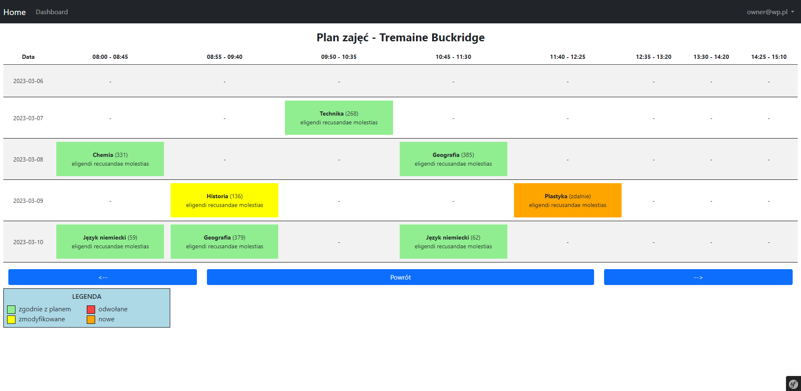

# school-app #

The application is a software solution designed to assist schools with managing various administrative tasks. With features such as student and staff information management, timetable scheduling, this application provides a comprehensive set of tools to help schools streamline their operations and improve efficiency. This application is an ideal solution for schools of all sizes, from small private institutions to large public universities. It is user-friendly, customizable, and can be tailored to meet the specific needs of any educational institution.

## Build with ##
1. PHP 7.4
2. BOOTSTRAP 5

## Features ##
1. User accounts initialization
2. Completion registration of initialized accounts 
3. Management of Schedule ( template )
4. Management of Schedule ( not fully completed )

## Possible Future Features ##
1. creating diplomas by class teachers
2. electronic notebook for school subjects
3. creating a list of topics for the subject by the teacher
4. making notes on topics for teachers
5. creating information about homework for students by teachers
6. own mailbox

## Installation Instructions ##
1. Run `git clone https://github.com/dawidbros1/school-app.git`
2. Run `composer install`
3. Run `php bin/console doctrine:migrations:migrate`
4. Configure your `./env` file
5. Run `php bin/console db:init`

## [ IMPORTANT ] FIRST STEP
1. Login as administrator/owner and go to dashboard
2. Create class times 
3. Create list of subjects

## Screenshots [ 06.03.2023 ]

### dashboard

* dashboard - admin panel

* dashboard - student/teacher panel

### users

* list of students - admin

* list of teachers - admin

### school subjects 

### lesson times

### class

* class list - admin

* class show - admin

  

* class show - student/teacher

  

### schedule template

### schedule

* class schedule - admin

* teacher schedule - admin

* schedule management - admin

* add lesson to schedule - admin

* schedule - student/teacher (desktop)

* schedule - student/teacher (mobile)

  

